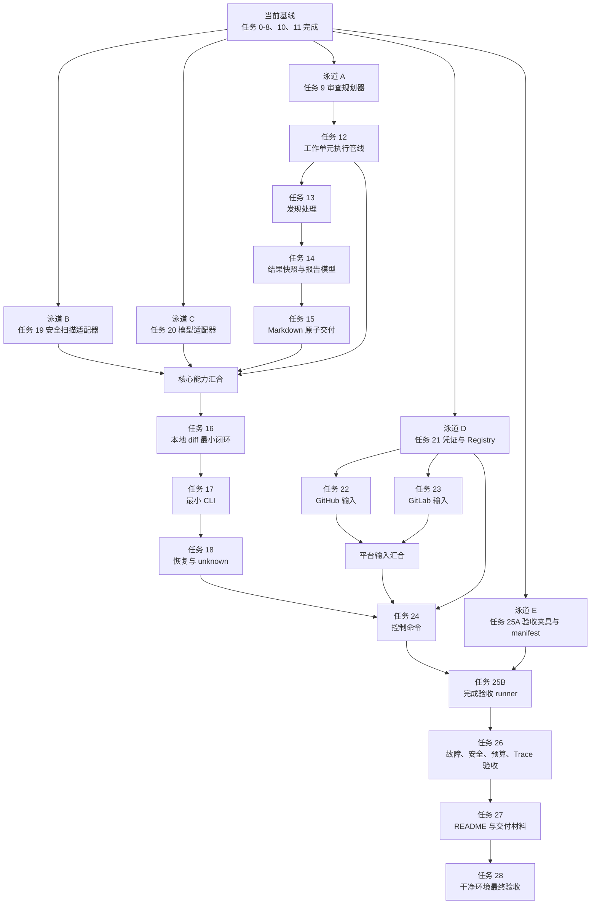

# Code Review Agent 并行开发任务流

**目标：** 在保持模块边界、测试门禁和可审查提交的前提下，将可独立开发的任务分配到多个隔离泳道，缩短剩余开发周期。

**当前基线：** 分支 `codex/freeze-baseline`，提交 `711dee0`。任务 0～8、10、11 已完成；后续任务编号沿用 `2026-09-10-code-review-agent-development-plan.md`。

**并行原则：** 只有依赖已经满足、无需共享可变状态且不会修改同一文件的任务才能并行。存在领域契约依赖或共同编辑应用编排、CLI、SQLite schema 的任务必须串行。

---

## 1. 总体任务流



## 2. 第一波：五条并行泳道

第一波从共同基线 `711dee0` 启动。每个任务使用独立 worktree 和分支，不共享工作目录。

| 泳道 | 任务 | 可并行原因 | 独占文件范围 |
| --- | --- | --- | --- |
| A | 任务 9：审查规划器 | 纯领域模块，只依赖已完成的输入模块 | `src/code_review_agent/domain/planning/`、`tests/unit/domain/planning/` |
| B | 任务 19：安全扫描适配器 | 安全领域契约已经完成 | `src/code_review_agent/adapters/security/`、`src/code_review_agent/resources/security_policy.toml`、`tests/integration/security/` |
| C | 任务 20：模型适配器 | 模型网关契约和 fake provider 已完成 | `src/code_review_agent/adapters/model/openai.py`、`src/code_review_agent/adapters/model/anthropic.py`、`tests/contract/model/` |
| D | 任务 21：凭证与 Registry | 可以独立实现基础设施能力 | `src/code_review_agent/adapters/credentials/`、`src/code_review_agent/adapters/registry.py`、凭证和 Registry 测试 |
| E | 任务 25A：验收数据准备 | 预标注夹具和 manifest 不依赖运行时实现 | `tests/fixtures/acceptance/`、`tests/fixtures/acceptance/manifest.toml` |

任务 25 在第一波只创建固定样例、输入哈希、语言、预期发现、禁止发现、期望置信度和需求映射。`tests/acceptance/test_acceptance_matrix.py` 等验收 runner 在任务 24 完成后接入，避免依赖尚未稳定的应用接口。

建议分支：

```text
codex/task-09-planner
codex/task-19-security-adapter
codex/task-20-model-adapters
codex/task-21-credentials-registry
codex/task-25-acceptance-fixtures
```

## 3. 第二波：核心领域串行链与平台输入并行链

### 3.1 核心领域串行链

任务 9 完成后，按以下顺序执行：

```text
任务 9 规划器
  → 任务 12 工作单元执行管线
  → 任务 13 发现处理和置信度
  → 任务 14 ResultSnapshot 和报告模型
  → 任务 15 Markdown 渲染和原子交付
```

这四个后续任务不得彼此并行：执行结果是发现处理的输入，发现集合是结果快照的输入，报告模型又是 Markdown 渲染的输入。并行开发会迫使下游猜测尚未冻结的公共契约。

### 3.2 平台输入并行链

任务 21 完成并冻结凭证和 Registry 契约后，同时启动：

| 泳道 | 任务 | 独占文件范围 |
| --- | --- | --- |
| D1 | 任务 22：GitHub PR 输入 | `src/code_review_agent/adapters/input/github.py` 及 GitHub 专属测试 |
| D2 | 任务 23：GitLab MR 输入 | `src/code_review_agent/adapters/input/gitlab.py` 及 GitLab 专属测试 |

两个 Agent 不得修改输入领域公共模型。若发现公共契约缺失，由主协调 Agent 创建独立的小型契约变更，完成审查并合入共同基线后，两个泳道再同步该提交。

## 4. 第三波：集成与恢复

任务 12～15、19、20 全部通过门禁后执行任务 16，完成应用编排和本地 diff 最小闭环。此处是第一次完整集成门禁，必须验证输入、规划、工具、模型、安全、预算、发现、快照和报告能够协同工作。

随后串行执行：

```text
任务 16 应用编排
  → 任务 17 review/status/trace 最小 CLI
  → 任务 18 暂停、恢复、unknown 和预算追加
```

任务 16～18 会连续修改应用编排、任务服务和 CLI，不能分配给同时工作的 Agent。

任务 18、21、22、23 汇合后执行任务 24。此时恢复、凭证、Provider Registry 和平台输入接口均已稳定，可以一次补齐控制命令，减少对 `commands.py`、`task_service.py` 和 `query_service.py` 的重复修改。

## 5. 第四波：验收与交付

任务 24 完成后，将任务 25A 的固定样例接入验收 runner，完成任务 25B。之后保持串行：

```text
任务 25B 固定验收矩阵
  → 任务 26 故障注入与安全验收
  → 任务 27 README 和交付材料
  → 任务 28 干净环境最终验收
```

任务 26 产生真实验收结果；任务 27 必须基于该结果记录范围和限制；任务 28 验证最终交付提交，因此三者不能并行。

## 6. Agent 分派模板

每个并行 Agent 的任务说明必须包含：

```text
任务：<一个可独立验收的目标>

共同基线：<commit SHA>
依据：
- <设计文档和章节>
- <FR/AC 编号>

允许修改：
- <精确文件或目录列表>

禁止修改：
- 其他泳道拥有的文件
- 未在本任务中声明的公共领域契约
- pyproject.toml、SQLite schema、应用编排和 CLI（除非本任务明确拥有）

执行要求：
1. 阅读依据和现有契约。
2. 先写失败测试并确认失败原因。
3. 编写满足测试的最小实现。
4. 运行目标测试、Ruff 和 mypy。
5. 检查跨层依赖、secret、裸第三方异常和隐式重试。
6. 返回变更摘要、实际命令与结果、提交 SHA 和剩余风险。
```

Agent 不得顺手重构公共文件。若任务需要修改禁止范围，先返回具体缺口和最小契约建议，由主协调 Agent 决定是否创建前置任务。

## 7. 汇合与审查门禁

每一波按以下流程汇合：

1. 各 Agent 在独立 worktree 中完成目标测试和静态检查。
2. 主协调 Agent 先做规格审查，确认任务覆盖对应设计、FR 和 AC。
3. 主协调 Agent 再做代码质量审查，检查 bug、安全风险、跨层依赖、恢复语义、隐式重试和 secret 泄露。
4. 按依赖顺序逐个合并到集成分支；每合并一个任务都运行受影响测试。
5. 一波全部合并后运行全量质量门禁。
6. 全量通过后，将新的集成提交作为下一波共同基线。

全量质量门禁：

```bash
uv run ruff format --check .
uv run ruff check .
uv run mypy src tests
uv run pytest
```

任何一个并行分支失败都不阻塞其他独立分支完成，但失败分支不得进入集成基线。修复时继续使用原分支和文件所有权，避免新开重复任务。

## 8. 文件所有权与冲突规则

- 一个并行波次中，每个文件只能有一个 Agent 拥有写权限。
- `pyproject.toml`、SQLite migration、公共端口、公共领域模型和应用编排默认归主协调 Agent。
- 测试夹具可按平台或模块拆分；公共测试 harness 只能由一个指定 Agent 修改。
- 不允许两个分支分别扩展同一个枚举、协议或数据库表后再依赖合并时解决。应先建立共同契约提交，再并行开发消费者。
- 合并冲突意味着原任务拆分不独立。主协调 Agent 应停止机械解冲突，重新确定所有权和契约顺序。

## 9. 当前环境状态

制定任务流时，当前环境无法执行基线质量门禁，因为 `uv` 命令不可用，以下命令均返回 `zsh: command not found: uv`：

```text
uv run pytest -q
uv run ruff check .
uv run ruff format --check .
uv run mypy src tests
```

开始第一波开发前应先恢复 `uv` 工具环境并运行全量基线检查。该问题属于本机开发工具缺失，不代表现有代码测试失败。
